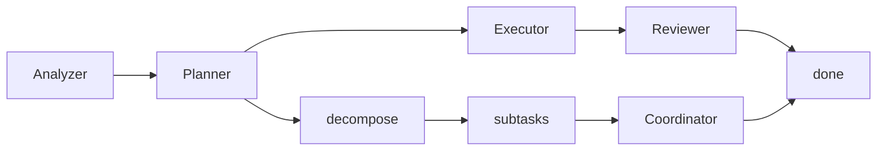
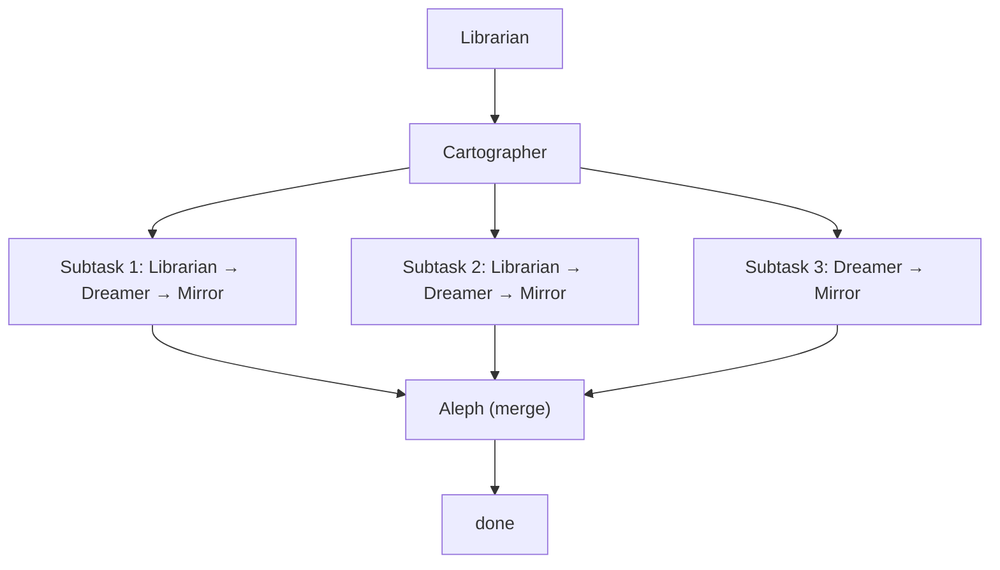

# babylon-scriptorium

A garden of forking agents — multi-agent LLM orchestration for coding tasks.

## Setup

```bash
# Install dependencies
npm install

# Set at least one API key
export ANTHROPIC_API_KEY=sk-ant-...
export OPENAI_API_KEY=sk-...

# Build
npm run build
```

## Usage

### CLI

```bash
# Run a task
babylon run "add input validation to the signup form"

# With options
babylon run "implement checkout flow" --budget 0.50 --max-depth 2 --no-cli

# Use a specific provider/model
babylon run "fix the broken test" --provider openai --model gpt-4o

# Non-interactive output
babylon run "rename getUserById to findUser across the codebase" --renderer log

# JSON output (for piping)
babylon run "add rate limiting to the API" --renderer none
```

### Programmatic API

```typescript
import { BabylonScriptorium } from "babylon-scriptorium"

const scriptorium = new BabylonScriptorium({
    anthropicApiKey: process.env.ANTHROPIC_API_KEY,
    workingDirectory: process.cwd(),
    maxDepth: 2,
    budgetDollars: 1.0,
})

const result = await scriptorium.run("implement user authentication")

console.log(result.status) // "completed" | "failed"
console.log(result.costSummary) // breakdown by role, model, agent
console.log(result.duration) // milliseconds
```

### Configuration file

Create `.babylonrc.json` in your project root:

```json
{
    "defaultProvider": "anthropic",
    "defaultModel": "claude-sonnet-4-20250514",
    "renderer": "terminal",
    "maxDepth": 2,
    "maxRetries": 2,
    "budgetDollars": 1.0,
    "useCli": true
}
```

Precedence: CLI flags > environment variables > `.babylonrc.json` defaults.

## CLI Flags

| Flag                 | Description                            | Default                    |
| -------------------- | -------------------------------------- | -------------------------- |
| `--provider <name>`  | LLM provider (`openai` or `anthropic`) | `anthropic`                |
| `--model <name>`     | Model name                             | `claude-sonnet-4-20250514` |
| `--renderer <type>`  | Output: `terminal`, `log`, or `none`   | `terminal`                 |
| `--budget <dollars>` | Maximum spend in USD                   | unlimited                  |
| `--max-depth <n>`    | Max recursion depth for decomposition  | `2`                        |
| `--no-cli`           | Disable `invoke_cursor_cli` tool       | enabled                    |
| `--cwd <path>`       | Working directory                      | current dir                |

## Architecture

For a deep dive, see [docs/ARCHITECTURE.md](docs/ARCHITECTURE.md).

Every task enters the same recursive cycle:



### The Five Agents

| Agent           | Alias            | Role                                                                      |
| --------------- | ---------------- | ------------------------------------------------------------------------- |
| **Analyzer**    | The Librarian    | Explores the codebase, classifies task complexity (simple/medium/complex) |
| **Planner**     | The Cartographer | Produces a spec with acceptance criteria, or decomposes into subtasks     |
| **Executor**    | The Dreamer      | Implements code changes — the only agent that writes files                |
| **Reviewer**    | The Mirror       | Reviews changes against the spec, runs tests, passes or fails with notes  |
| **Coordinator** | The Aleph        | Merges parallel subtask branches, resolves conflicts, verifies coherence  |

### Flow by complexity

**Simple** (rename a variable, fix a typo):


**Medium** (add a feature, fix a bug):


**Complex** (new system, large refactor):



### Safety

- **Token budget**: Set `--budget` to cap spend; workflow aborts if exceeded
- **Command blocklist**: `rm -rf /`, `git push --force`, `npm publish` etc. are blocked
- **File scope warnings**: Agents are warned when writing outside their assigned scope
- **Stuck loop detection**: Agents repeating the same tool call are broken out
- **Max turns**: Each agent has a turn limit; forced completion on the final turn
- **LLM retry**: Transient API errors (429, 5xx) retry with exponential backoff
- **Ctrl+C**: Clean abort propagated through all active agents

## Development

```bash
npm run dev          # Watch mode
npm run build        # Production build
npm run typecheck    # Type checking
npm run lint         # ESLint
npm run lint:fix     # Fix ESLint issues automatically
npm run format       # Format with Prettier
npm run format:check # Check formatting (CI)
npm run test         # Tests (watch mode)
npm run test:unit    # Tests (single run)
npm run test:coverage # Coverage report
```

Before completing any task, ensure: `npm run typecheck && npm run lint && npm run test:unit`. See [.cursor/rules/workflow.mdc](.cursor/rules/workflow.mdc) for full workflow and commit conventions.

## License

MIT
