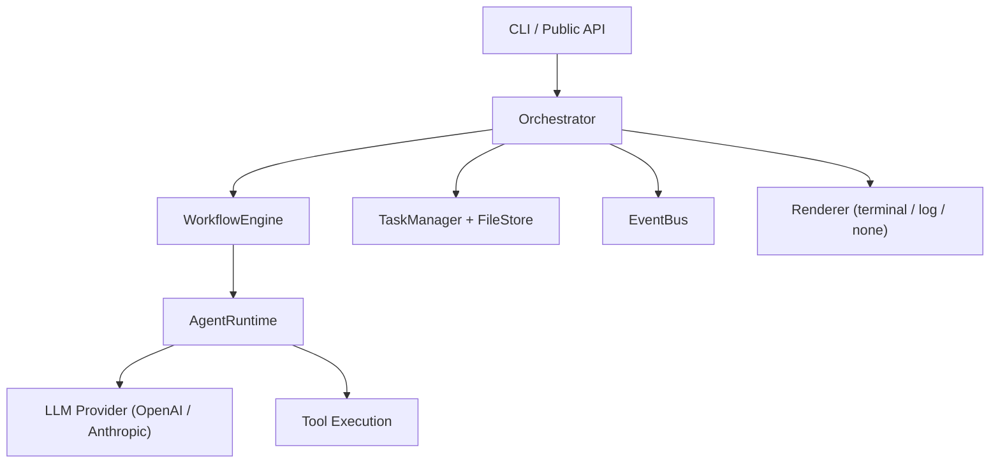
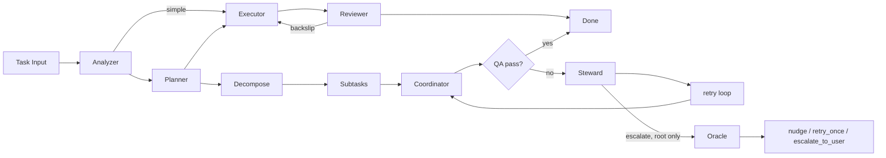
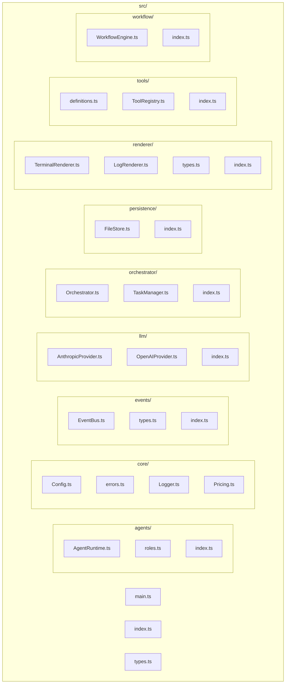

# Architecture

> *"I thought of a labyrinth of labyrinths, of one sinuous spreading labyrinth that would encompass the past and the future."*
> — Jorge Luis Borges, *The Garden of Forking Paths*

This document describes the internal design and architecture of babylon-scriptorium.

## Table of Contents

- [System Overview](#system-overview)
- [The Recursive Task Cycle](#the-recursive-task-cycle)
- [The Five Agents](#the-five-agents)
- [Steward and Oracle](#steward-and-oracle)
- [Module Map](#module-map)
- [Agent Runtime](#agent-runtime)
- [Workflow Engine](#workflow-engine)
- [Orchestrator](#orchestrator)
- [Tool System](#tool-system)
- [Event System](#event-system)
- [LLM Provider Abstraction](#llm-provider-abstraction)
- [Persistence](#persistence)
- [Rendering](#rendering)
- [Cost Tracking](#cost-tracking)
- [Safety and Resilience](#safety-and-resilience)
- [Scope and Isolation Controls](#scope-and-isolation-controls)
- [Configuration](#configuration)
- [Design Decisions](#design-decisions)
- [What's Deferred](#whats-deferred)

---

## System Overview

babylon-scriptorium is a multi-agent LLM orchestration system for coding tasks. It breaks a task into phases — analysis, planning, execution, review — and assigns each phase to a specialized agent. Complex tasks are decomposed recursively: subtasks re-enter the same cycle, and a coordinator merges the results.

The system is built as a pipeline of layers:



Every layer communicates through typed interfaces. The EventBus provides the cross-cutting observation channel: the Renderer, cost tracker, and any future integrations (WebSocket, dashboard) all subscribe to the same event stream.

---

## The Recursive Task Cycle

Every task — whether top-level or a subtask three levels deep — enters the same cycle:



**Three paths through the cycle**, determined by the Analyzer's complexity classification:

1. **Simple**: Analyzer → Executor → Reviewer → done. No planning needed.
2. **Medium**: Analyzer → Planner (spec) → Executor → Reviewer → done. The Planner writes a spec with acceptance criteria.
3. **Complex**: Analyzer → Planner (decompose) → recursive subtasks → Coordinator → done. The Planner breaks the task into subtasks, each of which re-enters the cycle at a deeper recursion depth.

The backslip loop: if the Reviewer fails a task, the Executor gets another attempt with the Reviewer's notes injected into context. This retries up to `maxRetries` (default 2) before the workflow fails.

---

## The Five Agents

Each agent is a distinct behavioral role, not a job title. The roles correspond to phases of work, and their separation ensures that no single agent has to both plan and execute, or both write and review.

### Analyzer (The Librarian)

Explores the codebase to understand the task. Reads files, lists directories, and runs commands to build a picture of the project. Outputs a structured analysis:

```json
{
    "complexity": "simple | medium | complex",
    "summary": "What this task involves",
    "affectedFiles": ["src/foo.ts", "src/bar.ts"],
    "recommendedApproach": "How to approach this"
}
```

**Tools**: `read_file`, `list_directory`, `run_terminal_command`, `complete_task`
**Model**: Claude Sonnet, temperature 0.3, max 5 turns

### Planner (The Cartographer)

Takes the Analyzer's output and produces one of two things:

1. **A spec** — for medium tasks. Includes acceptance criteria, expected files, and a file scope for the Executor.
2. **A decomposition** — for complex tasks. A list of subtasks with descriptions, file scopes, parallel/sequential flags, and an optional setup task for shared dependencies.

The Planner's output is a typed discriminated union (`PlannerOutput`), parsed and validated by the WorkflowEngine. If parsing fails, the raw content is treated as a spec.

**Tools**: `read_file`, `list_directory`, `run_terminal_command`, `complete_task`
**Model**: Claude Sonnet, temperature 0.5, max 10 turns

### Executor (The Dreamer)

The only agent that writes files. Takes a spec and implements it. Can use `invoke_cursor_cli` for complex edits or `write_file` for simple changes. Creates branches, makes commits, runs tests.

On backslip (retry after review failure), receives the Reviewer's notes prepended to its context with a `--- REVISION REQUIRED ---` header. Instructed to fix only the flagged issues.

**Tools**: `read_file`, `write_file`, `list_directory`, `run_terminal_command`, `git_operations`, `invoke_cursor_cli` (optional), `complete_task`
**Model**: Claude Sonnet, temperature 0.2, max 20 turns

### Reviewer (The Mirror)

Reviews the Executor's work against the spec. Runs `git diff`, reads modified files, checks acceptance criteria, runs the test suite. Passes or fails with specific, actionable notes.

A different model (GPT-4o) is used by default to provide an independent perspective.

**Tools**: `read_file`, `list_directory`, `run_terminal_command`, `git_operations`, `complete_task`
**Model**: GPT-4o, temperature 0.1, max 10 turns

### Coordinator (The Aleph)

Active only for complex tasks with parallel subtasks. Merges branches from all completed subtasks, resolves merge conflicts, verifies coherence, and runs the combined test suite. Named after Borges' Aleph — the point from which all other points are visible simultaneously.

**Tools**: `read_file`, `write_file`, `list_directory`, `run_terminal_command`, `git_operations`, `complete_task`
**Model**: Claude Sonnet, temperature 0.4, max 10 turns

---

## Module Map



---

## Agent Runtime

**File**: `src/agents/AgentRuntime.ts`

The AgentRuntime is the core conversation loop for a single agent. It manages the LLM call → tool execution → append results cycle until the agent calls `complete_task` or exhausts its turn budget.

### Lifecycle

1. **Initialization**: Receives an `AgentConfig` (role, system prompt, tools, model, maxTurns), an LLM provider, the EventBus, tool context, and optional abort signal.
2. **System prompt + initial context** are set as the first two messages.
3. **Turn loop**: For each turn up to `maxTurns`:
   - Check abort signal.
   - On the final turn, inject a nudge message: "You MUST call complete_task now."
   - Call the LLM.
   - If the response contains tool calls, execute them. If `complete_task` is called, parse and validate the result, then return.
   - If no tool calls, continue to the next turn (the LLM's response text is already in the conversation).
4. **Termination**: Returns an `AgentResult` with status, artifact, token usage, and full conversation log.

### Stuck Loop Detection

Tracks the last 3 tool call signatures (name + stringified arguments). If all 3 are identical, the agent is considered stuck and returns `needs_review`.

### LLM Retry

Transient errors (429, 5xx, timeouts, connection resets) are retried with exponential backoff: 1s, 2s, 4s. After 3 retries, the agent fails.

### Completion Validation

When `complete_task` is called, the result is parsed as JSON and validated for required fields (`status`, `summary`, `content`). If validation fails, the agent gets one correction turn with instructions to call `complete_task` again with valid fields.

### Events Emitted

| Event | When |
|-------|------|
| `agent:spawn` | Agent created |
| `agent:turn` | Each turn starts |
| `agent:tool_call` | Before executing a tool |
| `agent:tool_result` | After tool execution |
| `agent:complete` | Agent finished (via `complete_task`) |
| `token:update` | After each LLM call (per-call and cumulative usage) |

---

## Workflow Engine

**File**: `src/workflow/WorkflowEngine.ts`

The WorkflowEngine implements the recursive task cycle. It is the central orchestration logic that decides which agents to run and in what order.

### Entry Point

`run(taskDescription)` creates a workflow, emits `workflow:start`, runs `runTask()`, then emits `workflow:complete`.

### `runTask(options)`

The recursive core. Each call represents one pass through the task cycle:

1. **Skip analysis?** If `skipAnalysis` is true (set by the Planner for well-defined subtasks), jump straight to the execute-review cycle.
2. **Run Analyzer.** Parse the output to get complexity classification.
3. **Route by complexity:**
   - **Simple**: Skip to execute-review cycle with the Analyzer's summary as context.
   - **Medium/Complex**: Run Planner.
4. **Parse Planner output:**
   - **Spec**: Run execute-review cycle with the spec.
   - **Decomposition**: Run `runDecomposition()`.
5. **Max depth guard**: If recursion depth reaches `maxDepth`, force the Planner output to be treated as a spec.

### Execute-Review Cycle

`runExecuteReviewCycle(specContext, originalDescription, fileScope, depth)`

Runs the Executor, then the Reviewer. If the Reviewer fails and retries remain, injects review notes and loops back to the Executor. The `step:retry` event is emitted on each backslip.

### Decomposition

`runDecomposition(plan, originalDescription, depth, artifacts)`

1. If there's a `setupTask`, run it first (sequential, before anything else).
2. Run subtasks either in parallel (`Promise.all`) or sequentially, depending on the Planner's `parallel` flag. Each subtask recurses into `runTask()` at `depth + 1`.
3. If any subtask fails, the decomposition fails.
4. Run the Coordinator with summaries of all completed subtasks.

### Agent Invocation

`runAgent(role, userMessage, parentContext, fileScope, depth)` handles the common pattern of:
- Emitting `step:start`
- Resolving the model config and LLM provider
- Creating an `AgentRuntime` with the role's system prompt and tools
- Running the agent
- Emitting `step:complete`

---

## Orchestrator

**File**: `src/orchestrator/Orchestrator.ts`

The Orchestrator is the top-level coordinator. It wires together all subsystems and provides the public `run(description)` method.

### Responsibilities

- **LLM provider initialization**: Creates OpenAI and/or Anthropic providers based on available API keys.
- **Renderer attachment**: Creates and attaches the configured renderer to the EventBus.
- **WorkflowEngine construction**: Passes providers, tool resolver, EventBus, config, and abort signal.
- **Cost tracking**: Listens for `step:complete` events, calculates per-step costs, and emits `cost:update` events with running totals by role and model.
- **Budget enforcement**: If a `budgetDollars` ceiling is set, aborts the workflow when cumulative cost exceeds it.
- **Result assembly**: Builds the `RunResult` with `WorkflowCostSummary` (breakdowns by agent, role, and model).
- **TaskManager**: Creates tasks, updates their status, and persists artifacts.

### Abort Flow

The Orchestrator owns an `AbortController`. When `abort()` is called (e.g., from SIGINT), the signal propagates to every `AgentRuntime` instance via the shared `abortSignal`. Each agent checks the signal at the start of every turn and returns `failed` immediately if aborted.

---

## Tool System

**Files**: `src/tools/definitions.ts`, `src/tools/ToolRegistry.ts`

### Tool Definitions

Each tool is a `ToolDefinition` with a name, description, JSON Schema parameters, and an async `execute` function. Tools receive a `ToolContext` providing:

- `taskId` and `agentId` for logging/tracking
- `workingDirectory` for file operations
- `fileScope` (optional) for scope enforcement

### Available Tools

| Tool | Description |
|------|-------------|
| `read_file` | Read file contents (output truncated at 50k chars) |
| `write_file` | Write to a file; warns if outside assigned file scope |
| `list_directory` | List directory contents |
| `run_terminal_command` | Execute shell commands; blocked commands are rejected |
| `git_operations` | Git operations: status, branch, checkout, add, commit, diff, log, merge |
| `invoke_cursor_cli` | Invoke Cursor or Claude CLI for complex edits (optional, disabled with `--no-cli`) |
| `complete_task` | Signal task completion with structured result |

### Role → Tool Mapping

`getToolsForRole(role, options)` returns the tools available to each role. The mapping is fixed (not configurable by the agent):

- **Analyzer**: read_file, list_directory, run_terminal_command, complete_task
- **Planner**: read_file, list_directory, run_terminal_command, complete_task
- **Executor**: all tools (invoke_cursor_cli only if `useCli` is true)
- **Reviewer**: read_file, list_directory, run_terminal_command, git_operations, complete_task
- **Coordinator**: read_file, write_file, list_directory, run_terminal_command, git_operations, complete_task

### Command Blocklist

`run_terminal_command` checks commands against a regex blocklist before execution:

- `rm -rf /` or `rm -rf ~`
- `git push --force` / `git push -f`
- `npm publish`
- `sudo rm`
- `mkfs`
- `dd if=`
- Fork bombs

Blocked commands return an error without execution.

### File Scope Enforcement

`write_file` checks the target path against the `ToolContext.fileScope` array. If the path doesn't match any scope prefix, a warning is logged via the `tool` debug logger. The write still proceeds (warn-but-allow policy). The Reviewer is separately prompted to flag out-of-scope changes during review.

### Output Truncation

All tool outputs are capped at 50,000 characters. Truncated outputs preserve the first and last halves with a `[… truncated N characters …]` marker in the middle. This prevents conversation context from exploding due to large file reads or verbose command output.

### ToolRegistry

The `ToolRegistry` class provides optional per-role tool overrides. This is available for programmatic use but not exposed in the CLI. By default, it delegates to `getToolsForRole()`.

---

## Event System

**Files**: `src/events/EventBus.ts`, `src/events/types.ts`

### EventBus

A typed pub/sub channel built on Node's `EventEmitter`. All system events flow through a single bus. Consumers subscribe with `bus.on(handler)` and receive every `TaskBotEvent`.

### Event Types

The `TaskBotEvent` is a discriminated union with 13 event types:

**Workflow-level:**
- `workflow:start` — task description, workflow name, task ID
- `workflow:complete` — final status, duration

**Step-level (one per agent invocation):**
- `step:start` — step ID, role
- `step:complete` — status, duration, token usage
- `step:retry` — attempt number, reason

**Agent-level (within a single agent's conversation):**
- `agent:spawn` — agent ID, role, parent agent, step ID
- `agent:turn` — turn number, max turns
- `agent:tool_call` — tool name
- `agent:tool_result` — tool name, error flag, duration
- `agent:complete` — status, summary

**Tracking:**
- `token:update` — per-call and cumulative token usage
- `cost:update` — running cost totals by role and model

**Task management:**
- `task:status_change` — from/to status
- `task:subtask_created` — parent/child IDs

---

## LLM Provider Abstraction

**Files**: `src/llm/OpenAIProvider.ts`, `src/llm/AnthropicProvider.ts`, `src/llm/index.ts`

### Interface

```typescript
interface LLMProvider {
    chat(
        messages: LLMMessage[],
        tools: ToolDefinition[],
        model: ModelConfig
    ): Promise<LLMResponse>
}
```

Both providers implement the same interface. The `chat` method handles:
- Converting the internal message format to the SDK's format
- Converting `ToolDefinition` schemas to the provider's tool format
- Mapping the response back to the common `LLMResponse` type (content, tool calls, usage, stop reason)

### Provider Selection

The Orchestrator creates providers for all available API keys. The WorkflowEngine selects the provider based on the role's default `ModelConfig.provider` field, falling back to whichever provider is available.

---

## Persistence

**Files**: `src/persistence/FileStore.ts`, `src/orchestrator/TaskManager.ts`

### FileStore

A simple JSON file store in the `.babylon/` directory (configurable via `persistencePath`). Each key maps to a file: `key → basePath/key.json`.

**Atomic writes**: Data is written to a temporary file (`.tmp.<timestamp>`) first, then renamed to the target path. This prevents partial writes from corrupting data.

Operations:
- `write(key, data)` — serialize to JSON, atomic write
- `read<T>(key)` — read and parse, returns `null` for missing keys
- `exists(key)` — check if a key exists

### TaskManager

CRUD operations for `TaskData`, backed by the FileStore. Maintains an in-memory map for fast lookups and writes through to disk on every mutation.

Operations:
- `create(description, parentId?)` — create a new task with UUID
- `get(id)` — look up by ID (memory only)
- `updateStatus(id, status)` — update and persist
- `setComplexity(id, complexity)` — set task complexity
- `assignRole(id, role)` — assign an agent role
- `addArtifact(id, artifact)` — append an artifact
- `addSubtask(parentId, childId)` — link parent/child
- `load(id)` — load from disk if not in memory

---

## Rendering

**Files**: `src/renderer/TerminalRenderer.ts`, `src/renderer/LogRenderer.ts`, `src/renderer/types.ts`

### Renderer Interface

```typescript
interface Renderer {
    attach(bus: EventBus): void
    detach(): void
}
```

Renderers subscribe to the EventBus on `attach()` and unsubscribe on `detach()`.

### TerminalRenderer

A live-updating tree view using `chalk` for colors and `log-update` for in-place terminal updates. Refreshes every second via a tick interval.

The tree tracks:
- **Nodes** corresponding to workflow steps, with status glyphs (·, ⟳, ✓, ✗, ↻)
- **Per-node details**: current turn, active tool, elapsed time, token usage, cost
- **Agent hierarchy**: child agents appear nested under their parent step
- **Summary footer**: completed/total steps, cumulative tokens, cumulative cost, elapsed time

On workflow completion, renders a **cost breakdown** section showing costs by role (with Borgesian aliases) and by model, plus total tokens in/out. Final line: "The garden resolves" (success) or "Lost in the labyrinth" (failure).

### LogRenderer

A simple line-by-line logger. Each event is formatted as a structured log line with elapsed time. Useful for CI/CD or piping to files.

---

## Cost Tracking

**File**: `src/core/Pricing.ts`

### Model Pricing

A lookup table maps model names to per-million-token costs (input and output separately). Covers Claude Sonnet/Opus/Haiku and GPT-4o/4o-mini/4.1 variants. Unknown models fall back to Sonnet pricing with a debug log.

### Cost Calculation Flow

1. Each `AgentRuntime` emits `token:update` events with per-call and cumulative usage.
2. The Orchestrator listens for `step:complete` events. For each completed step, it calculates the cost using `calculateCost(model, tokenUsage)`.
3. The Orchestrator accumulates costs by agent, role, and model, then emits a `cost:update` event with the running totals.
4. The TerminalRenderer displays costs inline (per-step) and in the final breakdown.
5. The `RunResult` includes a full `WorkflowCostSummary` with breakdowns by agent, role, and model.

### Budget Enforcement

If `budgetDollars` is set, the Orchestrator checks cumulative cost on every `token:update` event. If the total exceeds the budget, the abort signal is triggered, and all active agents terminate on their next turn.

---

## Safety and Resilience

### Turn Limits

Each role has a default max turns (Analyzer: 5, Planner: 10, Executor: 20, Reviewer: 10, Coordinator: 10). On the final turn, the agent receives a nudge message forcing it to call `complete_task`. If it still doesn't complete, the result is `needs_review`.

### Stuck Loop Detection

If an agent makes the exact same tool call (same name and arguments) 3 consecutive times, it's considered stuck. The loop is broken and the agent returns `needs_review`.

### LLM Retry

Rate limits (429), server errors (5xx), timeouts, and connection resets trigger automatic retry with exponential backoff (1s → 2s → 4s). After 3 retries, the call fails.

### Command Blocklist

Dangerous shell commands are blocked before execution. The blocklist uses regex patterns to catch variations.

### Abort Propagation

SIGINT (Ctrl+C) triggers the Orchestrator's `AbortController`. The signal is checked at the start of every agent turn. Active agents complete their current tool call but don't start new turns.

### Recursion Depth Limit

The `maxDepth` setting (default 2) prevents unbounded decomposition. At max depth, the Planner is forced to produce a spec rather than decompose further.

### Backslip Limit

The execute-review cycle retries up to `maxRetries` (default 2) times. After that, the workflow fails rather than looping indefinitely.

---

## Scope and Isolation Controls

### File Scope (Warn-but-Allow)

The Planner assigns a `fileScope` to each subtask — an array of path prefixes indicating which files the Executor should touch. The `write_file` tool checks each write against this scope and logs a warning on violations, but does not block the write. The Reviewer is instructed to flag out-of-scope changes as failures.

### Branch-per-Subtask Isolation

For parallel decompositions, each subtask's Executor can work on its own Git branch. Branches are named `babylon/<taskId>/<subtask-index>`. After all subtasks complete, the Coordinator merges each branch sequentially, resolving conflicts and running the combined test suite.

### Scope Drift Prevention

Built into the system prompts:

- **Planner**: Outputs acceptance criteria, expected affected files, and file scope per subtask. Can emit a setup subtask for shared dependencies.
- **Executor**: "Only modify files required by the spec. Do not refactor unrelated code. Note gaps in handoff_notes, don't fix them."
- **Reviewer**: "Run `git diff`. Flag changes outside expected scope. Under-delivery is a failure."
- **Coordinator**: "Verify no subtask conflicts with another's intent. Run the full test suite."

---

## Configuration

### Layered Configuration

Configuration is resolved with the following precedence (highest first):

1. **CLI flags**: `--provider`, `--model`, `--renderer`, `--budget`, `--max-depth`, `--no-cli`, `--cwd`
2. **Environment variables**: `OPENAI_API_KEY`, `ANTHROPIC_API_KEY`
3. **`.babylonrc.json`**: Project-level defaults

### BabylonConfig

```typescript
interface BabylonConfig {
    openaiApiKey?: string
    anthropicApiKey?: string
    workingDirectory: string
    persistencePath?: string       // default: <cwd>/.babylon
    defaultProvider?: LLMProviderType
    defaultModel?: string
    renderer?: RendererType        // "terminal" | "log" | "none"
    maxDepth?: number              // default: 2
    maxRetries?: number            // default: 2
    budgetDollars?: number         // default: unlimited
    useCli?: boolean               // default: true
}
```

### Per-Role Defaults

Each role has a default model, temperature, max output tokens, and turn limit configured in `src/core/Config.ts`. These are not currently overridable per-run (a post-V1 consideration).

---

## Design Decisions

### Why 5 roles instead of more (or fewer)?

The roles map to **distinct behavioral phases**, not job titles. Each role has a unique capability set (tools) and a unique output format. Merging any two (e.g., Analyzer + Planner) would create agents with muddled responsibilities. Splitting any one (e.g., separate Test Runner and Code Reviewer) would add coordination overhead without proportional benefit in V1.

### Why recursion instead of a DAG workflow?

A fixed DAG requires predefining every possible path. The recursive model is simpler: every task goes through the same cycle, and complexity is handled by depth, not by topology. This also makes the system self-similar — a subtask looks exactly like a top-level task to any agent processing it.

### Why a different model for the Reviewer?

Using GPT-4o for review while using Claude Sonnet for execution provides an independent perspective. The Reviewer is less likely to approve changes that merely "look right" to the same model that generated them.

### Why warn-but-allow for file scope?

Hard-blocking writes would prevent agents from fixing legitimate issues discovered during implementation (e.g., a type error in a file outside the planned scope). The warn-but-allow approach lets the work proceed while creating a signal for the Reviewer to evaluate.

### Why no mid-flight replanning?

Replanning after failed retries adds significant complexity (stale context, conflicting branches, looping decompositions). V1 fails cleanly on exhausted retries. The operator can re-run with a refined description.

### Why Planner decides parallel vs. sequential?

The Planner has the most context about inter-subtask dependencies. It reads the codebase and understands which changes can be made independently. A static heuristic (e.g., "always parallel if different file scopes") would miss semantic dependencies.

---

## What's Deferred

The following are explicitly out of scope for V1 but designed to be addable without architectural changes:

- **React dashboard**: The EventBus and WebSocket server plumbing support a real-time web UI. The React app itself is deferred.
- **Conversation pruning / context summarization**: Long agent conversations will eventually hit context limits. Summarization and pruning strategies are post-V1.
- **Mid-flight replanning**: When retries are exhausted, the workflow could go back to the Planner instead of failing. Deferred to avoid complexity.
- **Additional roles**: Researcher (pre-execution context gathering from docs/APIs), Test Writer (dedicated test authoring). These can be added as new entries in the role prompt map and tool config.
- **Parallel file conflict detection**: V1 relies on the Planner to minimize overlap and the Coordinator to resolve conflicts. Static analysis of file scopes is a potential enhancement.

---

## Logging

Uses the `debug` package with an `app:` prefix. Enable with the `DEBUG` environment variable:

```bash
DEBUG=app:*                     # All logs
DEBUG=app:llm,app:agent         # LLM calls and agent lifecycle
DEBUG=app:workflow               # Workflow engine decisions
DEBUG=app:tool                   # Tool execution details
DEBUG=app:persistence            # File store operations
```

Available namespaces: `app`, `llm`, `agent`, `workflow`, `orchestrator`, `tool`, `persistence`, `cli`.
